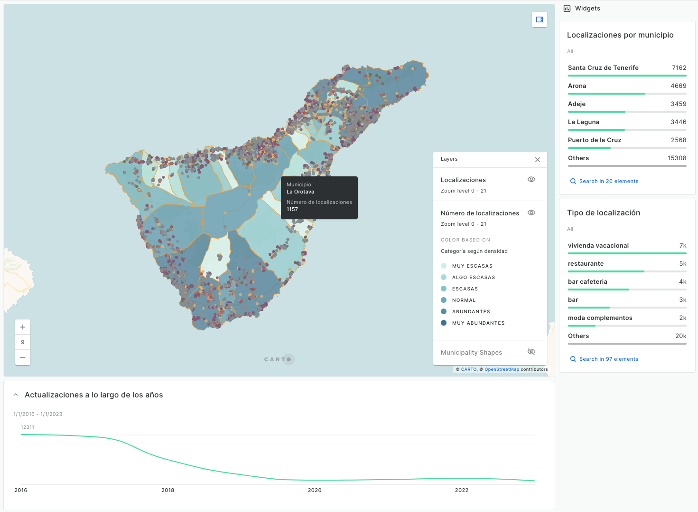

# Análisis de datos en base a factores de gentrificación en Tenerife

Este Trabajo de Fin de Máster se basa en el desarrollo de visualizadores en base a indicadores relevantes influyentes en el proceso de gentrificación de un lugar, en concreto, la isla de Tenerife, con el fin de llegar como conclusión a conocer el grado de gentrificación de cada uno de los municipios de la isla en función de estos indicadores, como pueden ser el **precio medio de alquiler por metro cuadrado**, el **índice de criminalidad**, la **población total** o el **número de comercios hosteleros** en un municipio.

Además, para contrastar estas conclusiones visuales, se hace un análisis de datos exploratorio (EDA) en profundidad, además de el desarrollo de un modelo de *machine learning* para conocer cómo se agrupan estos municipios en base a su situación.

### Código

El código del proyecto se encuentra dividido en dos secciones diferenciadas:

* [/scripts](https://github.com/omendo-uoc/tfm-gentrification-data/tree/dev/scripts): Scripts de Python para realizar la carga de datos previa creación de las tablas correspondientes en PostgreSQL.

* [/methods](https://github.com/omendo-uoc/tfm-gentrification-data/tree/dev/scripts): Scripts de Python para realizar el EDA y el clustering.

### Fuentes de datos
Los conjuntos de datos utilizados para el desarrollo del proyecto están alojados en la carpeta [/data](https://github.com/omendo-uoc/tfm-gentrification-data/tree/dev/data), donde se podrán consultar dichos conjuntos en función de la etapa del proyecto que se esté consultando:
* [/raw](https://github.com/omendo-uoc/tfm-gentrification-data/tree/dev/data/raw): Conjuntos de datos crudos tras ser extraídos.
* [/processed](https://github.com/omendo-uoc/tfm-gentrification-data/tree/dev/data/processed): Datos transformados con **dbt**.
* [/final](https://github.com/omendo-uoc/tfm-gentrification-data/tree/dev/data/final): Conjuntos de datos procesados y cruzados con datos geoespaciales de los municipios listos para ser explotados en Carto.

Estos conjuntos de datos han sido extraídos de las siguientes fuentes:

* [Instituto Canario de Estadística](https://www.gobiernodecanarias.org/istac/)
* [Instituto Nacional de Estadística](https://www.ine.es/)
* [Canarias Datos Abiertos](https://datos.canarias.es/portal/)
* [Ministerio del Interior](https://estadisticasdecriminalidad.ses.mir.es/publico/portalestadistico/balances.html): índices de criminalidad.
* [Fotocasa](https://www.fotocasa.es/es/)
* [Idealista](https://www.idealista.com/)

### Mapas en Carto

* [Mapa referente a las localizaciones en los distintos municipios de la isla](https://pinea.app.carto.com/map/c4971515-f095-43d7-9911-47faa3b97da8)

* [Mapa referente a la evolución de indicadores en los distintos municipios - Población total](https://pinea.app.carto.com/map/154c26a9-6d08-4c2c-bf00-83998306a297)

* [Mapa referente a la evolución de indicadores en los distintos municipios - Saldo migratorio](https://pinea.app.carto.com/map/89c30037-6c8e-48f1-9966-6712708c72ed)

* [Mapa referente a la evolución de indicadores en los distintos municipios - Empresas inmobiliarias](https://pinea.app.carto.com/map/0156e166-b208-4c9a-8f6c-138ee139876c)

* [Mapa referente a la evolución de indicadores en los distintos municipios - Empresas hosteleras](https://pinea.app.carto.com/map/e538c28e-a22f-410d-b8dc-5c08c3dc019e)

* [Mapa referente a la evolución de indicadores en los distintos municipios - Precio de venta de viviendas por metro cuadrado](https://pinea.app.carto.com/map/3c313564-79a9-4b2d-891d-2f6d078ec709)

* [Mapa referente a la evolución de indicadores en los distintos municipios - Precio de alquiler de viviendas por metro cuadrado](https://pinea.app.carto.com/map/dabe077e-0a2e-4dfb-bb8b-5826044a70d6)

* [Mapa del clustering con k-means para k = 3](https://pinea.app.carto.com/map/85606aa8-7d57-42a1-89e2-70f1d950f34b)

* [Mapa del clustering con k-means para k = 4](https://pinea.app.carto.com/map/5d555a26-8291-436d-bc16-cc51d69f7087)